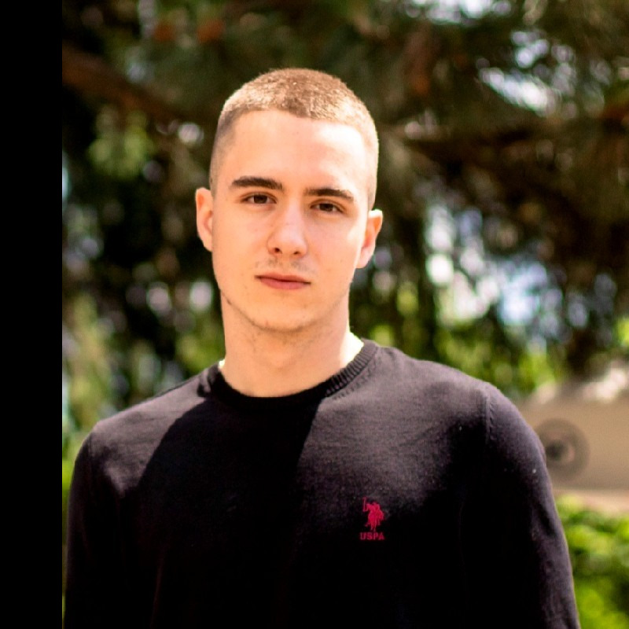

# Starting template

This README will need to contain a description of your project, how to run it, how to set up the development environment, and who worked on it.
This information can be added throughout the course, except for the names of the group members.
Add your own name (do not add the names for others!) to the section below.

## Description of project

## Group members

| Profile Picture                                                  | Name                     | Email                              |
|------------------------------------------------------------------|--------------------------|------------------------------------|
|         | Bryan Wassenaar          | B.J.A.Wassenaar@student.tudelft.nl |
|  | Bulboaca Alexandru-Eugen | A.Bulboaca@student.tudelft.nl      |
|     | Łukasz Rek		          | Rek@student.tudelft.nl             |
|        | Tom Kitak		      | tkitak@student.tudelft.nl             |

<!-- Instructions (remove once assignment has been completed -->
<!-- - Add (only!) your own name to the table above (use Markdown formatting) -->
<!-- - Mention your *student* email address -->
<!-- - Preferably add a recognizable photo, otherwise add your GitLab photo -->
<!-- - (please make sure the photos have the same size) --> 

## How to run it

## How to contribute to it

## Copyright / License (opt.)
